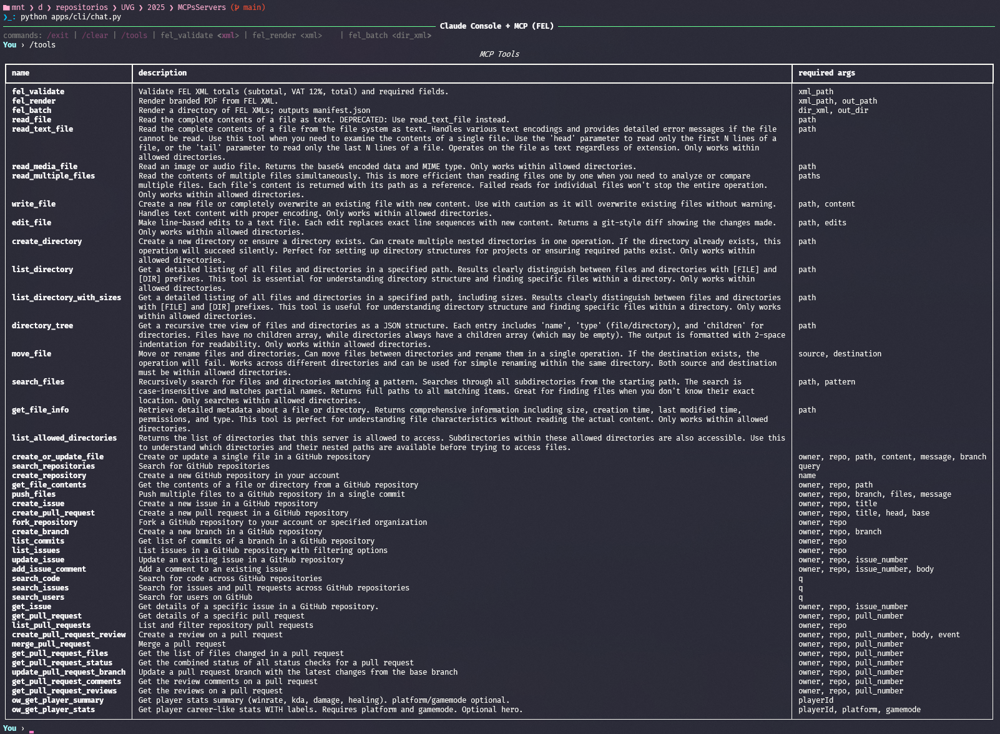

# Chatbot (CLI) · MCP Client

Console-based chatbot that connects to **Anthropic Claude** and can call tools exposed by **Model Context Protocol (MCP)** servers (e.g., a local FEL server).  
Maintains conversational context, can auto/manuelly call tools, and logs sessions as structured JSONL.

## 🔗 Related repositories

- [MCP FEL (Local)](https://github.com/JosueSay/MCPLocalFEL) — MCP server used by this client (validate/render/batch FEL).
- [Reference: OpenAI Chat API Example](https://github.com/JosueSay/Selectivo_IA/blob/main/docs_assistant/README.md) — reference only (API connectivity & instruction patterns).

## ✨ Features

- Anthropic Claude API client (streaming, context carry-over).
- **Tool calling** (manual `/tools` & automatic) via MCP.
- Session logs in **JSONL**.
- Works with local MCP via **STDIO** (WSL) or remote MCP via URL.

## ⚙️ Requirements

- **Python 3.12**
- **WSL Ubuntu 22.04** (or Linux)
- Virtualenv recommended

## 🔧 Installation

When starting the chatbot, you can now run **multiple MCP servers at the same time**.  
This allows you to combine local tools (e.g., FEL) with external integrations like **Filesystem** and **GitHub**.

### Environment Variables

Edit your `.env` with the following variables:

```env
# ---- Keys ----
ANTHROPIC_API_KEY=your_key
ANTHROPIC_MODEL=claude-sonnet-4-20250514 # optional, other models: https://docs.anthropic.com/en/api/models-list
GITHUB_TOKEN=your_token # Personal Access Token (fine-grained or classic)

# ---- MCPS ----
MCP_FEL_CMD="/ABSOLUTE/PATH/venv/bin/python /ABSOLUTE/PATH/servers/fel_mcp_server/server_stdio.py"
MCP_URL=url_mcp # pending

# Multiple MCP servers (comma-separated)
# Recommended order: FEL (local), Filesystem (Docker), GitHub (Docker)
MCP_CMDS="/ABSOLUTE/PATH/venv/bin/python /ABSOLUTE/PATH/servers/fel_mcp_server/server_stdio.py,docker run --rm -i -v /ABSOLUTE/PATH/data/testing:/data node:22 npx -y @modelcontextprotocol/server-filesystem /data,docker run --rm -i -e GITHUB_TOKEN node:22 npx -y @modelcontextprotocol/server-github"

# ---- Chat Config ----
LOG_DIR=/ABSOLUTE/PATH/TO/REPO/data/logs/sessions
ROUTER_DEBUG=0 # 1: active | 0: inactive
```

### GitHub MCP

To use the **GitHub MCP** you need:

1. Create a **personal token** (fine-grained or classic).

2. Clone the official MCP servers repository to an absolute path:

   ```bash
   git clone https://github.com/modelcontextprotocol/servers.git
   ```

3. Replace `/ABSOLUTE/PATH/servers` in your `.env` with the actual path to the cloned repo.

This way, the chatbot can launch and orchestrate multiple MCPs in parallel.

## 🚀 Usage

Start the chatbot from the project root:

```bash
python apps/cli/chat.py
```

You will see:

```bash
───────────────────── Claude Console + MCP (FEL) ──────────────────────
commands: /exit | /clear | /tools | fel_validate <xml> | fel_render <xml> | fel_batch <dir_xml>
You ›
```

### Example

```text
You › /tools
MCP Tools
name         | description                                  | required args
-------------|----------------------------------------------|---------------
fel_validate | Validate FEL XML totals and required fields  | xml_path
fel_render   | Render branded PDF from FEL XML              | xml_path
fel_batch    | Render directory of FEL XMLs -> manifest.json | dir_xml
```

```bash
You › puedes validar precios de data/xml/factura.xml?
La validación de la factura fue exitosa. Los totales calculados son:

 • Subtotal: Q8,010.59
 • IVA (12%): Q961.27
 • Total: Q8,971.86

No se encontraron errores en los precios ni en los campos requeridos.
```

If absolute paths for the official MCP servers were set, you can now have more tools available: **FEL + System Files + GitHub**.



## 📝 Logs

- Stored in `LOG_DIR` as **JSONL** (one object per event).
- Useful to trace **tool usage**, **model decisions**, and **errors**.

## 📚 References

- [Model Context Protocol](https://modelcontextprotocol.io/)
- [Anthropic API](https://docs.anthropic.com/en/api)
- [JSON-RPC 2.0](https://www.jsonrpc.org/)
